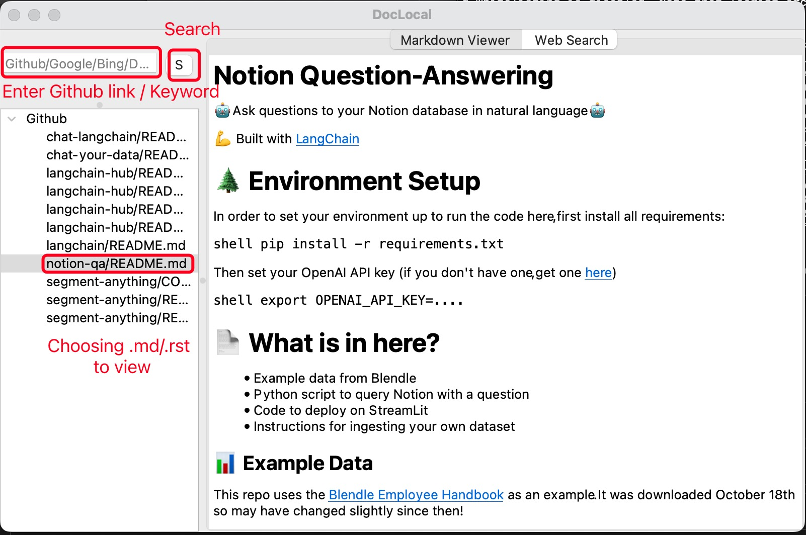
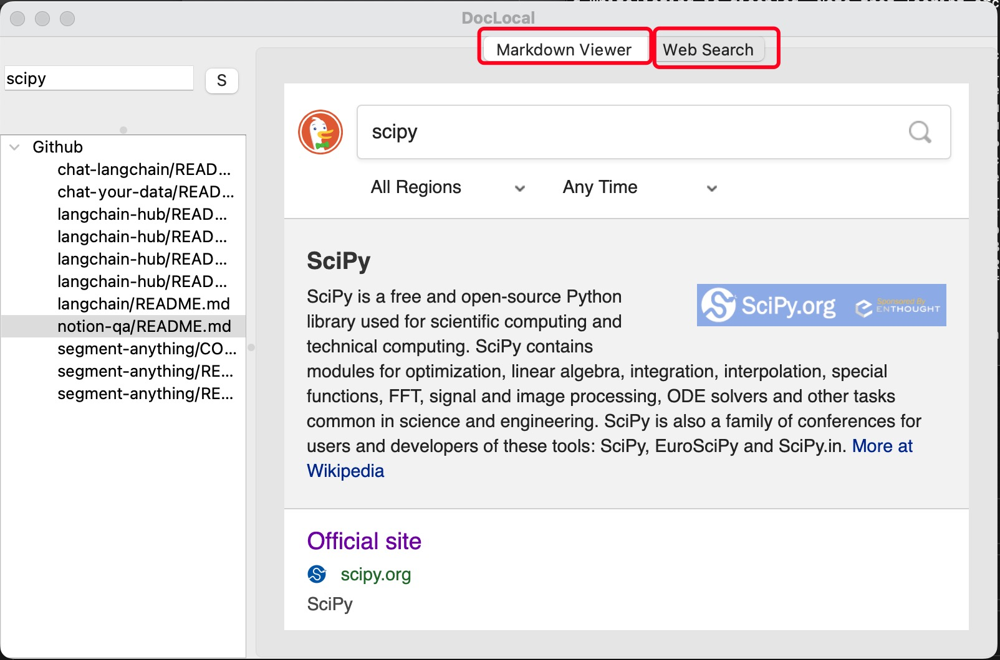

# DocLocal
A demo GUI that integrating GitHub documents to local.

## Features

Enter Github repo link to download all readme files under the repo!

Integrate Google/Bing/DuckDuckgo websearch into GUI page.


## Installation
```shell 
pip install PyQt5 markdown requests
```

## Usage
```shell
python GUI.py
```
Selecting searching engine, default Google
```shell
python GUI.py --search_engine duckduckgo
```
Selecting path, default current path. 
```shell
python GUI.py --maindir /Users/user/Doc/GitRepo/DocLocal/
```
Notice that it will generate default 'Github' filepath to store downloaded readme files.


## Update&TODO
TODO:
- Git module is needed for parsing and generating subdirectories.  
- Other website's documentation and wikis need to be added (which document formats are supported for parsing?).  
- A list of commonly used websites and a cheatsheet need to be added.  
- Display using GitHub icon/other icons as required.  
- Support for DIY tag.   
- Some websites are timing out, e.g. https://github.com/facebookresearch/segment-anything.  
- Support linked png from Github without downloading. Suppoort other file format.  


### 230613 update:
- Parse for supporting Google/DuckDuckgo/Bing search.   
- Support for .rst and .md files.     
- Use original filenames instead of readme1234. Add renaming function for duplicate names.  
- Address Issue: Chinese names cannot be displayed. Use quote to address it.  
- Address Issue: Unable to update the second link.  
- Automatically switch to the web search tab after clicking.  
- Automatically open the Markdown file after successful GitHub download and update the left directory bar.[X]  
- Cancel the main code directory on the left and only keep the subdirectories.[X]  
- Display a loading progress bar during the loading process.[X]  

### 230612 achieved:
- Direct download in the box.   
- Browser loading.   
- Integrated page for Markdown/Web Search.   
